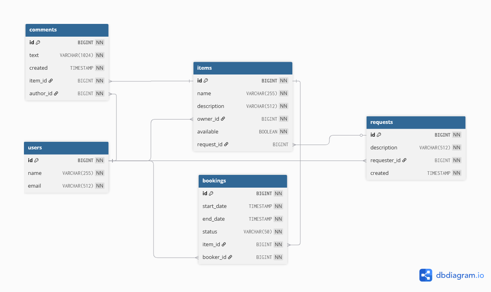

# ShareIt

Микросервисное приложение для шеринга вещей между пользователями. Позволяет размещать вещи, искать нужные, бронировать их на определённые даты и оставлять отзывы после использования.

## Архитектура

Проект состоит из двух модулей, взаимодействующих по REST:

```
Client → Gateway (8080) → Server (9090) → PostgreSQL
```

- **Gateway** — валидация входящих запросов и маршрутизация на сервер через HTTP-клиенты (`BaseClient` + `RestTemplate`)
- **Server** — бизнес-логика, персистентность, слоёная архитектура (Controller → Service → Repository → JPA Entity)

Контекст пользователя передаётся через заголовок `X-Sharer-User-Id`.

## Функциональность

**Вещи (Items)**
- Публикация вещей с описанием и статусом доступности
- Полнотекстовый поиск по названию и описанию
- Привязка вещей к запросам от других пользователей

**Бронирования (Bookings)**
- Создание бронирования на выбранные даты
- Подтверждение / отклонение владельцем вещи
- Фильтрация по статусам: ALL, CURRENT, PAST, FUTURE, WAITING, REJECTED

**Запросы (Item Requests)**
- Создание запроса на нужную вещь
- Просмотр чужих запросов с пагинацией
- Автоматическая привязка откликов (предложенных вещей)

**Отзывы (Comments)**
- Комментарий к вещи после завершённого бронирования

## Стек

| Категория | Технологии |
|-----------|------------|
| Язык | Java 21 |
| Фреймворк | Spring Boot 3.3.2, Spring MVC, Spring Data JPA |
| БД | PostgreSQL 15, Hibernate |
| Маппинг | MapStruct 1.5.5, Lombok |
| Тестирование | JUnit 5, Mockito, MockMvc, H2 (integration) |
| Качество кода | Checkstyle, SpotBugs, JaCoCo (90% line coverage) |
| Инфраструктура | Docker Compose, Maven (multi-module) |

## Схема БД

5 таблиц: `users`, `items`, `bookings`, `comments`, `requests`. Центральная сущность — `items`, связанная с владельцем (`users`), бронированиями, комментариями и запросами.



## Запуск

```bash
# 1. Поднять PostgreSQL
docker compose up -d

# 2. Собрать проект
mvn clean install

# 3. Запустить сервер (порт 9090)
java -jar server/target/server-0.0.1-SNAPSHOT.jar

# 4. Запустить gateway (порт 8080)
java -jar gateway/target/gateway-0.0.1-SNAPSHOT.jar
```

## Тестирование

```bash
# Все тесты
mvn test

# С отчётом покрытия (server)
mvn -P coverage test -pl server

# Checkstyle + SpotBugs
mvn -P check verify
```

Тесты включают: unit-тесты контроллеров (MockMvc), интеграционные тесты с H2, тесты сериализации DTO, тесты MapStruct-маппинг.
